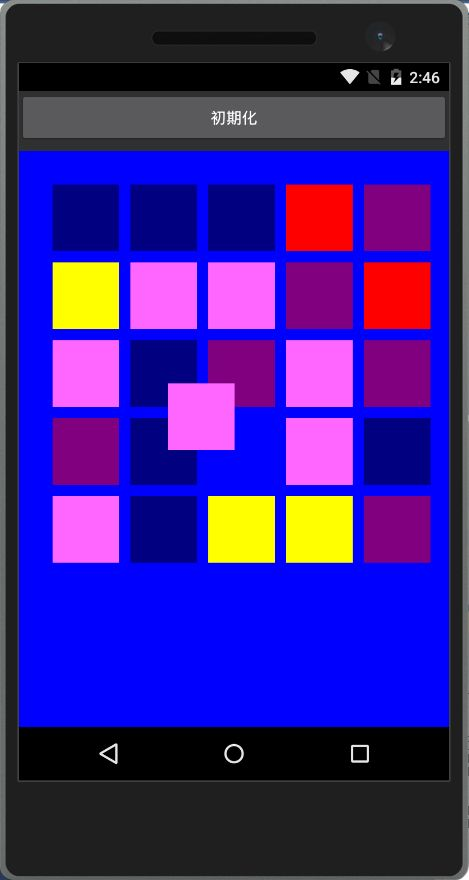
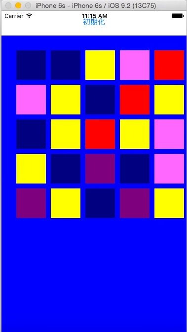
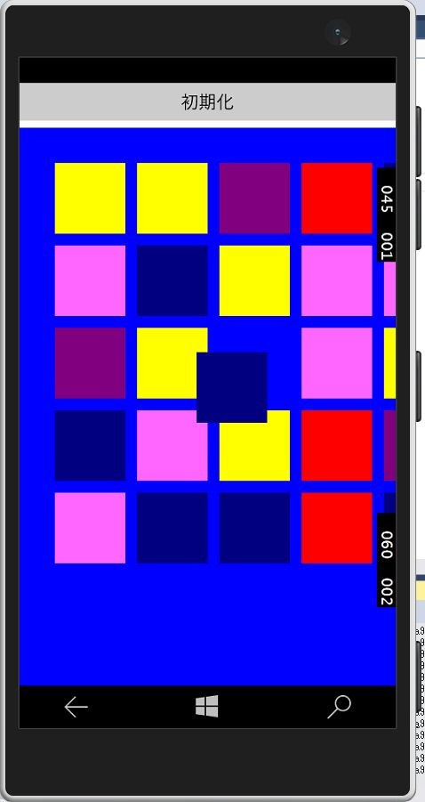
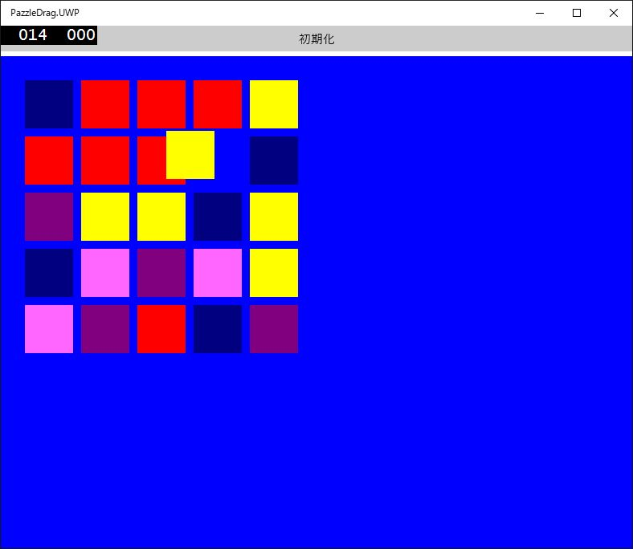

Xamarin.Forms でコントロールをドラッグする、のサンプル
===============
Xamarin.Forms では何故かコントロールのドラッグができないので実装してみるテストです。

各種（Android/iOS/UWP）側でレンダラーを使って描画＆タップ制御、本体の PCL プロジェクトでコントロールを移動させます。

# Demo

サンプルとして、コントロール（BoxView）を使ってパズドラっぽい動きをさせます。

## Android

## iPhone

## Windows 10 Mobile 

## UWP on Windows 10

# License

The MIT License (MIT)

# 日本語の解説

あとで用意。

